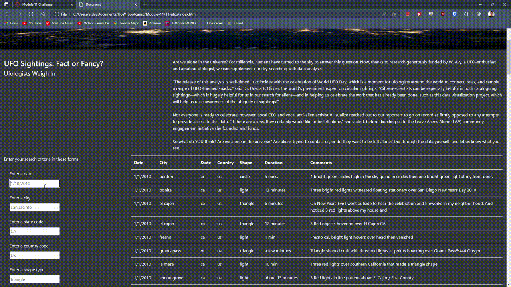

# Challenge 11, Deliverable 2

## Purpose

The purpose of this analysis is to be able to **return different parts of a table of data that specifically match the user's filter criteria**. I was given a table of data consisting of the date of a UFO sighting, the city, state, and country it occurred in, the shape of the UFO, how long the observation lasted, and any comments associated with the observation. The goal was to create a website with HTML, CSS, and using the JavaScript language to make it more manageable for the end user to manipulate the data.

## Results

The results of this analysis show that the table is dynamic and does not need to reload the page or click on any buttons to be able to filter the data using any of the search criteria. An end user might use this web page to apply one or several different filters to the data table to return a more specific result. Say, if a user was looking to limit the results of the data to UFO observations for only on a particular day, the user could enter "1/10/2010" in only that filter text box. Or if the user wanted to view all observations on that day but only the ones in Maryland, the user could add another filter "md" to the state filter box.

I've attached a GIF demonstrating both using single and multiple filters.

## Summary

#### Conclusion
In summary, the system used to filter the data works as intended, and works better than the first version which did not allow for multiple filters. I think one drawback of this new design is that there is no way to filter on multiple values in the same filter criteria. For example: if the end user wanted to search for all observation results in two states, California and Oregon, that is not currently possible in this version of the program. That would be one implementation for further development that I would like to work on. Another recommendation for further development is adding another filter criteria: filtering on comments. That is also not currently possible in this version of the program, and I think that may be helpful to some users looking to find observation data where comments seem to describe similar UFO's or similar circumstances surrounding the sighting. I would also like to implement some way for the user to download the filtered table for their own use.

#### Final words
One thing that I noticed was that the filter criteria was very specific, and needed exact matches between the filter and the data table. I took a step towards easing those restrictions - this was not already implemented, which I changed in my version of the program. The user's input can be in any capitalization but the string will not match, even if the characters are the same. I fixed this by chaining the .toLowerCase() method to the input for the filter criteria to change the capitalization to all lowercase.
